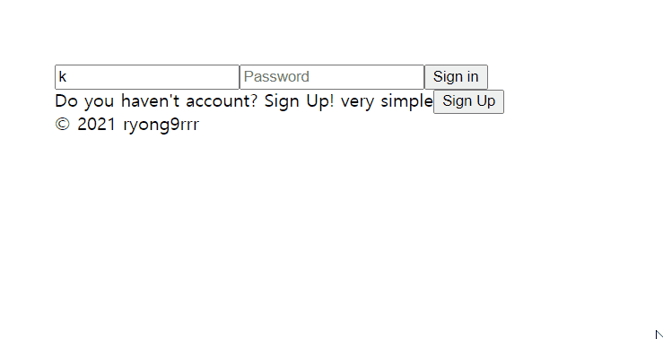

# 리액트 연습

`git config --global core.autocrlf true`

## 목차

- #1.2 react-router-dom 으로 router set-up
- #2.2 Login-Form with useState
- #2.3 로그인창에서 Home창으로 가기 작업중..
- #2.4 로그인, 가입하기
- #2.5 Home창 Nav

---

## #1.2 react-router-dom 으로 router set-up

`npm -i --save react-router-dom`

로그인상태가 아니면 Login창으로, 로그인상태라면 Home창으로 이동하도록 설정

## #2.2 Login-Form with useState

Hooks를 활용한 로그인폼 작성중

`const { a: b } = c` 이런 문법에 대해 정확히 알았다.

## #2.3 로그인창에서 Home창으로 가기 작업중..

localStorage를 가상 데이터베이스라고 생각하고 일단 계정을 만들어 놓고, email & password 값이 일치하면 Home창으로 가는 작업중.

어떻게하면 Router.js의 useState를 true로 바꿀 수 있을까?

## #2.4 로그인, 가입하기

과감하게 AppRouter.js 를 삭제, Login 과 CreateAccount 에서 반복사용되는 구조는 useForm 으로 리팩토링 해볼 것.

## #2.5 Home창 Nav

Notion 비슷하게 만들어보자
